# Panduan Pengguna — KedaiPOS

**Cara Membuat Pesanan dan Menerima Bayaran**

Versi 1.1 · Kemas kini 21 Ogos 2026

---

## Kandungan

1. [Pengenalan](#1-pengenalan)
2. [Mengenali Antara Muka](#2-mengenali-antara-muka)
3. [Langkah 1 — Buka Sistem](#langkah-1--buka-sistem)
4. [Langkah 2 — Tapis Produk Mengikut Kategori](#langkah-2--tapis-produk-mengikut-kategori)
5. [Langkah 3 — Cari Produk](#langkah-3--cari-produk)
6. [Langkah 4 — Tambah Produk Biasa ke Troli](#langkah-4--tambah-produk-biasa-ke-troli)
7. [Langkah 5 — Buka Produk Berpilihan](#langkah-5--buka-produk-berpilihan)
8. [Langkah 6 — Pilih Variasi Produk](#langkah-6--pilih-variasi-produk)
9. [Langkah 7 — Tetapkan Kuantiti Sebelum Tambah](#langkah-7--tetapkan-kuantiti-sebelum-tambah)
10. [Langkah 8 — Semak Troli](#langkah-8--semak-troli)
11. [Langkah 9 — Laras Kuantiti atau Buang Item](#langkah-9--laras-kuantiti-atau-buang-item)
12. [Langkah 10 — Masukkan Diskaun](#langkah-10--masukkan-diskaun)
13. [Langkah 11 — Tekan Butang Bayar](#langkah-11--tekan-butang-bayar)
14. [Langkah 12 — Pilih Kaedah Pembayaran](#langkah-12--pilih-kaedah-pembayaran)
15. [Langkah 13 — Bayaran Tunai](#langkah-13--bayaran-tunai)
16. [Langkah 14 — Bayaran Kad](#langkah-14--bayaran-kad)
17. [Langkah 15 — Bayaran QR Code](#langkah-15--bayaran-qr-code)
18. [Langkah 16 — Sahkan Bayaran dan Cetak Resit](#langkah-16--sahkan-bayaran-dan-cetak-resit)
19. [Langkah 17 — Semak Sejarah Transaksi](#langkah-17--semak-sejarah-transaksi)
20. [Petua Pantas](#petua-pantas)
21. [Masalah Lazim](#masalah-lazim)

---

## 1. Pengenalan

KedaiPOS ialah sistem jualan (Point of Sale) untuk kedai makan. Sistem ini membolehkan
juruwang menerima pesanan, memilih variasi makanan seperti jenis lauk dan saiz minuman,
mengira cukai dan diskaun, menerima bayaran secara **tunai, kad atau QR Code**,
serta mencetak resit.

Panduan ini menerangkan proses lengkap dari memilih menu sehingga bayaran selesai.
Setiap langkah disertakan gambar skrin sebenar daripada sistem.

**Keperluan:**

- Pelayar web moden (Chrome, Edge, atau Firefox)
- Sistem dibuka melalui pelayan tempatan, contohnya `http://localhost/claude-learn1/`

---

## 2. Mengenali Antara Muka

Skrin utama terbahagi kepada tiga bahagian:

| Bahagian | Lokasi | Fungsi |
|---|---|---|
| **Bar Atas** | Paling atas | Papar jam semasa, butang **Variasi** dan butang **Sejarah** |
| **Panel Produk** | Kiri (besar) | Medan carian, butang kategori, dan senarai kad produk |
| **Panel Troli** | Kanan | Senarai pesanan semasa, subjumlah, cukai, diskaun, jumlah dan butang **Bayar** |

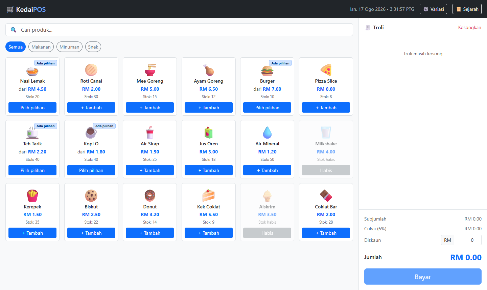

**Maklumat pada setiap kad produk:**

- Ikon dan nama produk
- Harga — dipapar sebagai `dari RM x.xx` jika produk mempunyai pilihan variasi
- Baki stok
- Label **Ada pilihan** di penjuru kanan atas bagi produk yang mempunyai variasi
- Produk yang kehabisan stok dipaparkan kelabu dan berlabel **Habis** — ia tidak boleh diklik

---

## Langkah 1 — Buka Sistem

Buka pelayar web dan layari alamat sistem. Skrin utama akan memaparkan semua produk
yang tersedia. Troli bermula dalam keadaan kosong dengan mesej *"Troli masih kosong"*.


> **Nota:** Butang **Bayar** dilumpuhkan selagi troli kosong.

---

## Langkah 2 — Tapis Produk Mengikut Kategori

Untuk mempercepat pencarian, tekan butang kategori di bawah medan carian:
**Semua**, **Makanan**, **Minuman**, atau **Snek**.

Contoh di bawah menunjukkan kategori **Minuman** dipilih — hanya produk minuman dipaparkan.

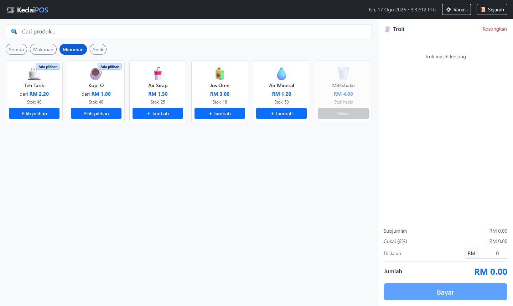

Tekan **Semua** untuk kembali memaparkan keseluruhan menu.

---

## Langkah 3 — Cari Produk

Jika menu terlalu banyak, taip nama produk dalam medan **Cari produk...** di bahagian atas.
Senarai akan ditapis secara langsung semasa anda menaip.

Contoh: menaip `nasi` memaparkan hanya produk **Nasi Lemak**.

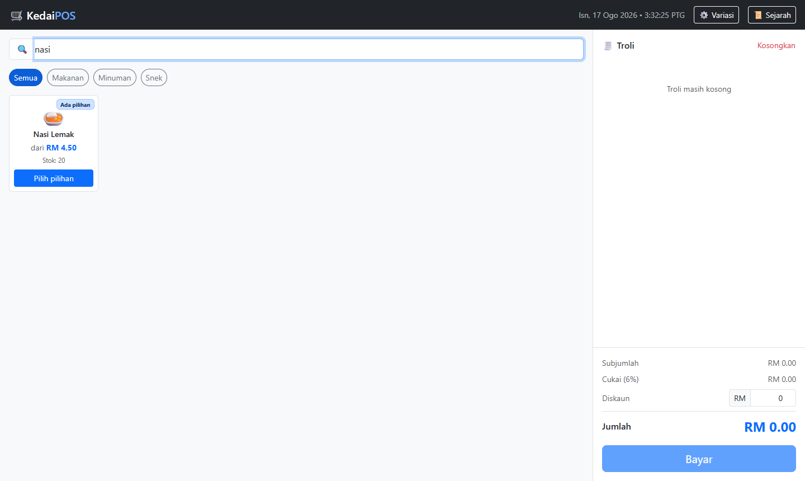

Kosongkan medan carian untuk memaparkan semula semua produk.

---

## Langkah 4 — Tambah Produk Biasa ke Troli

Produk tanpa variasi memaparkan butang **+ Tambah**. Cukup tekan kad produk sekali
dan item terus masuk ke troli.

Contoh: menekan **Roti Canai** menambah satu unit pada harga RM 2.00.

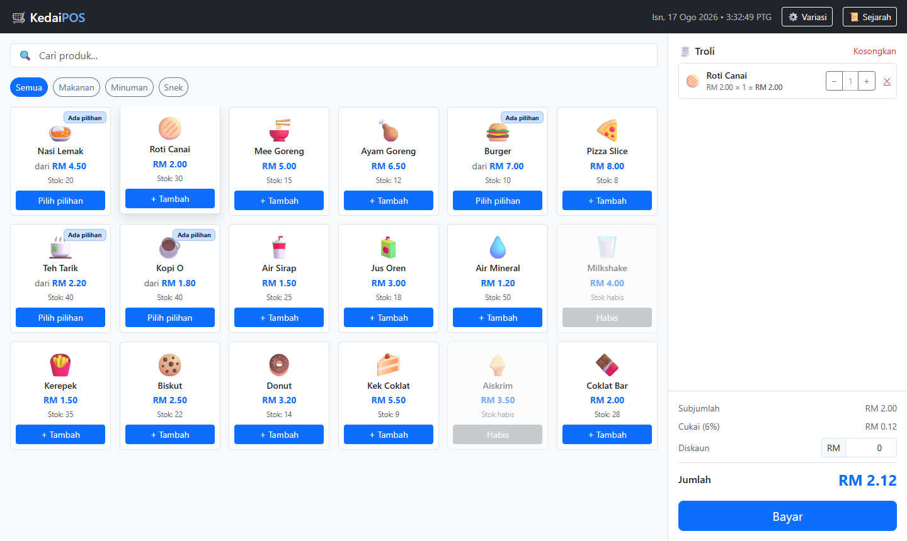

> **Petua:** Tekan kad produk yang sama berulang kali untuk menambah kuantiti.
> Sistem akan menggabungkannya dalam satu baris troli, bukan mencipta baris baharu.

---

## Langkah 5 — Buka Produk Berpilihan

Produk yang mempunyai label **Ada pilihan** memaparkan butang **Pilih pilihan**.
Menekan kad produk ini akan membuka tetingkap variasi.

Contoh: menekan **Nasi Lemak** membuka tetingkap dengan tiga kumpulan pilihan —
**Lauk**, **Kepedasan**, dan **Tambahan**.

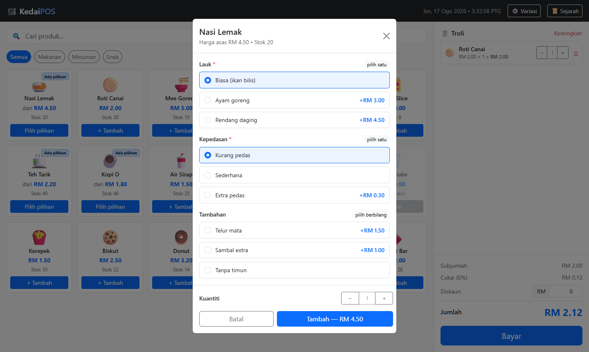

**Maksud tanda pada tetingkap:**

| Tanda | Maksud |
|---|---|
| Tanda bintang merah `*` | Kumpulan wajib — mesti dipilih sebelum boleh tambah |
| `pilih satu` | Hanya satu pilihan dibenarkan (butang bulat) |
| `pilih berbilang` | Boleh pilih lebih daripada satu (kotak semak) |
| `+RM 3.00` | Harga tambahan bagi pilihan tersebut |
| `−RM 0.20` | Potongan harga bagi pilihan tersebut |

---

## Langkah 6 — Pilih Variasi Produk

Tekan pilihan yang dikehendaki. Pilihan yang aktif akan bertukar warna biru, dan
harga pada butang **Tambah** di bahagian bawah dikemas kini serta-merta.

Contoh pilihan: **Ayam goreng** (+RM 3.00), **Extra pedas** (+RM 0.30),
dan **Telur mata** (+RM 1.50).

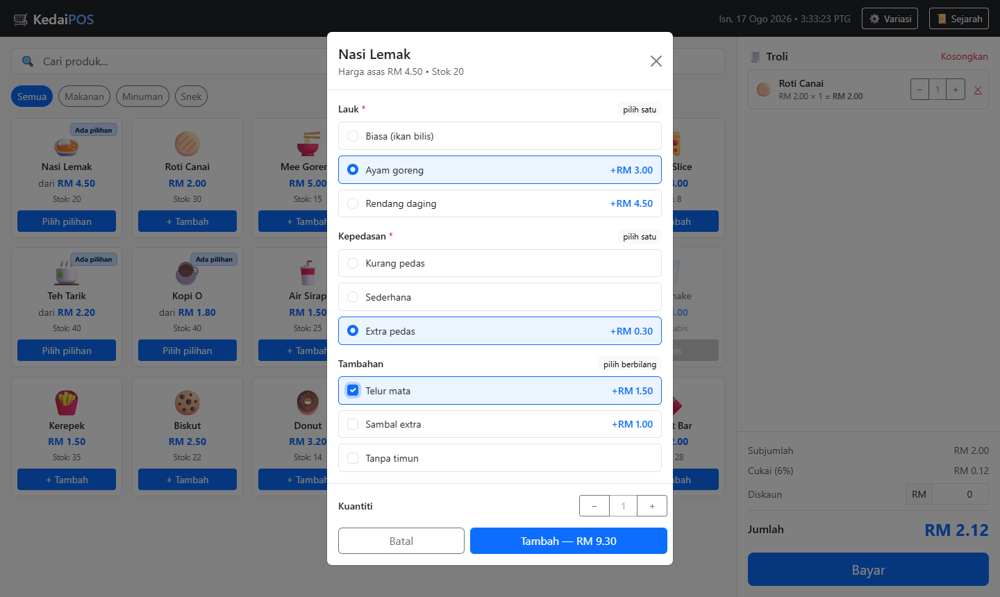

Pengiraan harga seunit:

```
Harga asas         RM 4.50
Ayam goreng      + RM 3.00
Extra pedas      + RM 0.30
Telur mata       + RM 1.50
─────────────────────────
Harga seunit       RM 9.30
```

---

## Langkah 7 — Tetapkan Kuantiti Sebelum Tambah

Di bahagian bawah tetingkap variasi terdapat kawalan **Kuantiti**. Tekan **+** untuk
menambah atau **−** untuk mengurangkan sebelum memasukkan item ke troli.

Contoh: kuantiti ditetapkan kepada **2**, menjadikan jumlah RM 18.60 (RM 9.30 × 2).

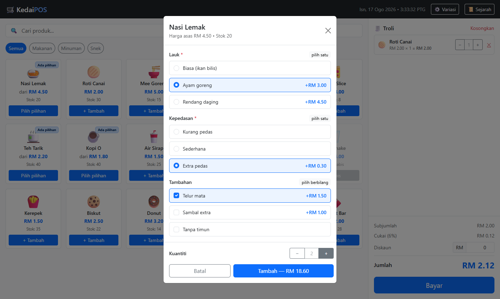

Tekan butang biru **Tambah — RM 18.60** untuk memasukkan ke troli.
Tekan **Batal** jika ingin membatalkan.

---

## Langkah 8 — Semak Troli

Setiap item yang ditambah muncul di panel troli sebelah kanan. Bagi item bervariasi,
pilihan dipaparkan dalam tulisan condong di bawah nama produk.

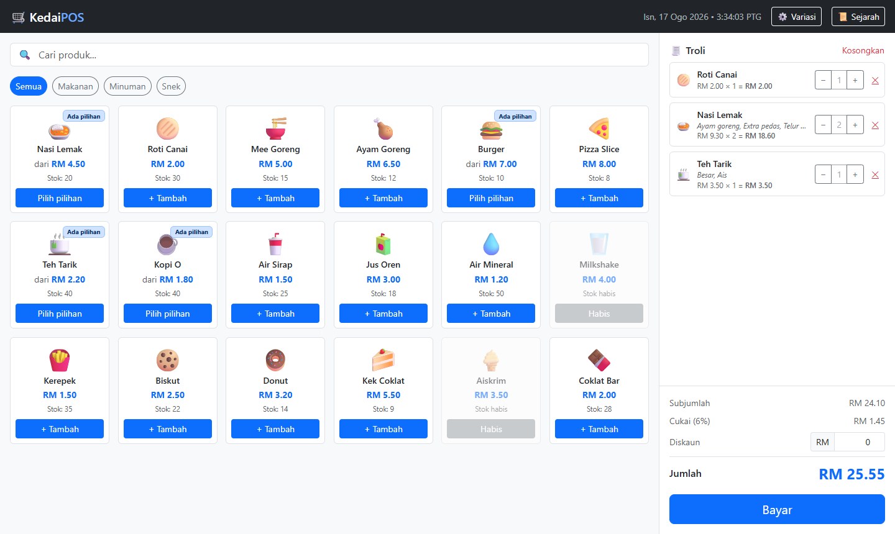

Panel bawah troli memaparkan pengiraan automatik:

- **Subjumlah** — jumlah semua item sebelum cukai
- **Cukai (6%)** — dikira daripada subjumlah
- **Diskaun** — medan yang boleh diisi sendiri
- **Jumlah** — amaun akhir yang perlu dibayar

---

## Langkah 9 — Laras Kuantiti atau Buang Item

Pada setiap baris troli terdapat tiga kawalan:

| Butang | Fungsi |
|---|---|
| **−** | Kurangkan kuantiti sebanyak satu |
| **+** | Tambah kuantiti sebanyak satu |
| **✕** | Buang item tersebut terus dari troli |

Contoh: kuantiti **Roti Canai** dinaikkan kepada 2, menjadikan RM 4.00.

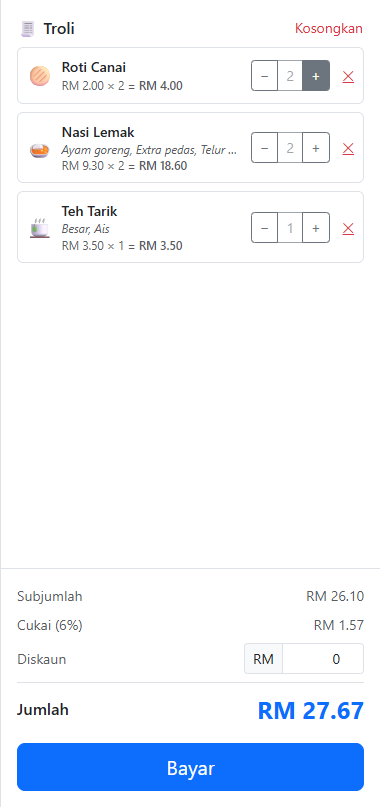

Untuk mengosongkan keseluruhan troli, tekan pautan merah **Kosongkan** di penjuru
kanan atas panel troli.

> **Nota:** Item bervariasi yang berbeza pilihan dikira sebagai baris berasingan.
> Contohnya Teh Tarik *Besar, Ais* dan Teh Tarik *Kecil, Panas* akan muncul sebagai dua baris.

---

## Langkah 10 — Masukkan Diskaun

Jika pelanggan layak mendapat potongan, taip amaun dalam medan **Diskaun** (dalam Ringgit).
Jumlah akhir dikemas kini secara langsung.

Contoh: diskaun RM 2.50 menurunkan jumlah daripada RM 27.67 kepada RM 25.17.

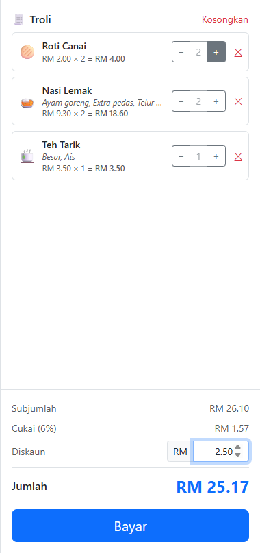

Formula pengiraan:

```
Jumlah = Subjumlah + Cukai (6%) − Diskaun
       = RM 26.10  + RM 1.57    − RM 2.50
       = RM 25.17
```

Biarkan medan diskaun pada `0` jika tiada potongan.

---

## Langkah 11 — Tekan Butang Bayar

Setelah pesanan lengkap, tekan butang biru **Bayar** di bahagian bawah troli.
Tetingkap pembayaran akan terbuka dan memaparkan **Jumlah Perlu Dibayar**.

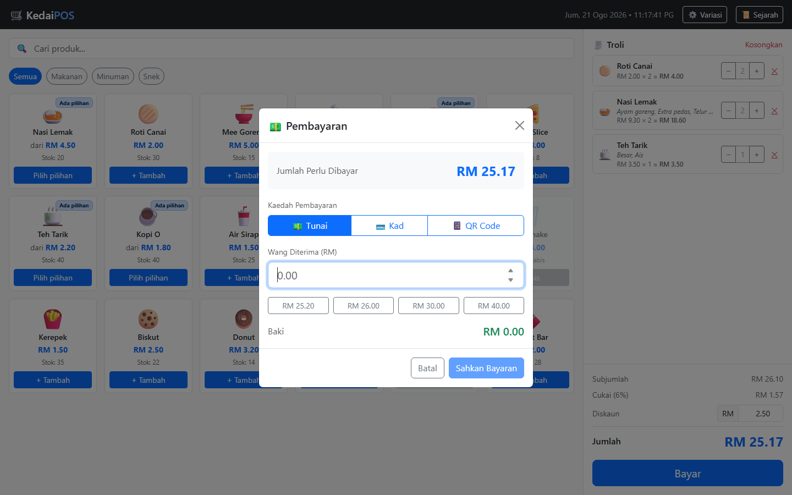

---

## Langkah 12 — Pilih Kaedah Pembayaran

Di bawah jumlah bayaran terdapat baris **Kaedah Pembayaran** dengan tiga pilihan.
Tekan salah satu butang mengikut cara pelanggan membayar. **Tunai** dipilih secara
lalai setiap kali tetingkap dibuka.

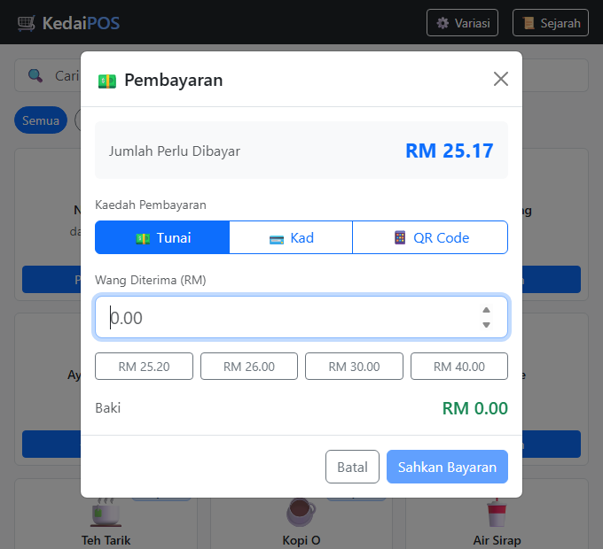

| Kaedah | Bila digunakan | Apa yang berlaku pada skrin |
|---|---|---|
| **💵 Tunai** | Pelanggan bayar dengan wang tunai | Medan **Wang Diterima (RM)**, butang wang pantas dan pengiraan **Baki** dipaparkan |
| **💳 Kad** | Pelanggan bayar dengan kad debit atau kredit | Medan tunai disembunyikan; skrin memaparkan **Amaun Dicaj** sahaja |
| **📱 QR Code** | Pelanggan imbas kod QR (e-dompet / DuitNow) | Medan tunai disembunyikan; skrin memaparkan **Amaun Dicaj** sahaja |

> **Nota:** Kaedah boleh ditukar seberapa kerap yang perlu sebelum bayaran disahkan.
> Jumlah perlu dibayar tidak berubah walau apa pun kaedah yang dipilih.

---

## Langkah 13 — Bayaran Tunai

Pastikan butang **💵 Tunai** dipilih, kemudian taip amaun tunai yang diterima daripada
pelanggan dalam medan **Wang Diterima (RM)**. Baki dikira secara automatik dan dipapar
dalam warna hijau.

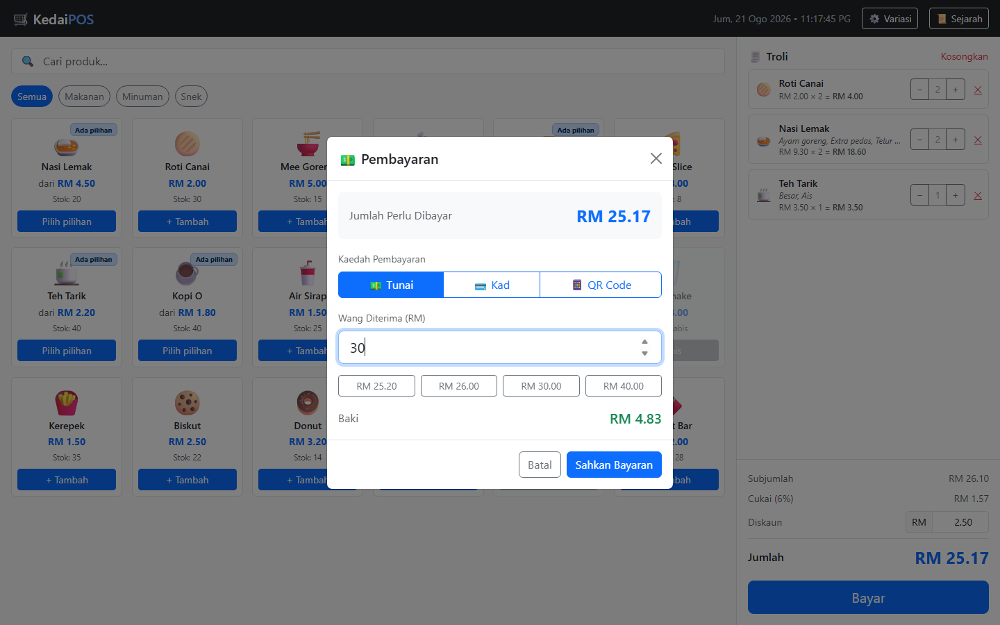

**Butang wang pantas** di bawah medan tersebut memasukkan amaun lazim dengan satu tekanan
sahaja — contohnya `RM 25.20`, `RM 26.00`, `RM 30.00` dan `RM 40.00` bagi jumlah RM 25.17.
Ia hanya cadangan; anda masih boleh taip amaun lain secara manual.

Contoh: pelanggan membayar RM 30.00 bagi jumlah RM 25.17, maka baki ialah RM 4.83.

> **Nota:** Butang **Sahkan Bayaran** hanya berfungsi apabila wang yang dimasukkan
> mencukupi. Jika kurang daripada jumlah, butang tersebut kekal kelabu.

---

## Langkah 14 — Bayaran Kad

Tekan butang **💳 Kad**. Medan wang tunai akan hilang dan digantikan dengan arahan
ringkas beserta **Amaun Dicaj**, iaitu jumlah penuh yang perlu dicaj pada terminal kad.

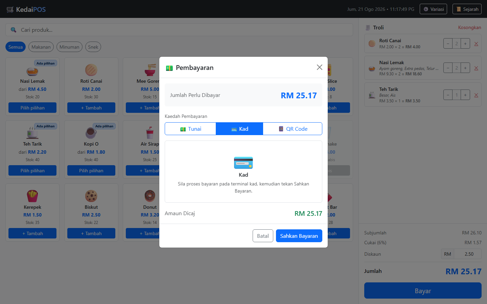

Urutan kerja yang betul:

1. Caj amaun yang dipaparkan pada terminal kad.
2. Tunggu terminal mengesahkan bayaran berjaya.
3. Barulah tekan **Sahkan Bayaran** dalam KedaiPOS.

> **Amaran:** Jangan tekan **Sahkan Bayaran** sebelum terminal kad mengesahkan transaksi
> berjaya. Sistem tidak berhubung dengan terminal kad — ia hanya merekod kaedah yang anda pilih.

---

## Langkah 15 — Bayaran QR Code

Tekan butang **📱 QR Code**. Skrin memaparkan arahan supaya pelanggan mengimbas kod QR
kedai, berserta **Amaun Dicaj**.

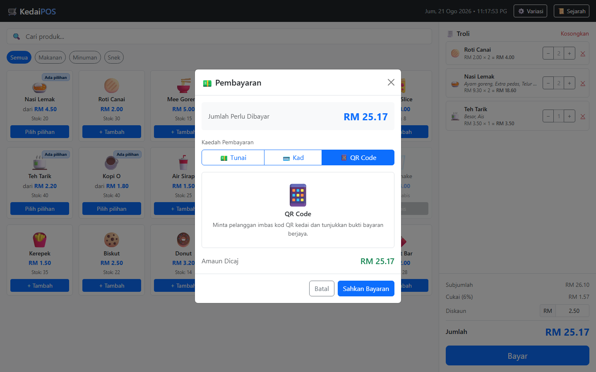

Urutan kerja yang betul:

1. Tunjukkan kod QR kedai kepada pelanggan (pelekat kaunter atau aplikasi bank).
2. Minta pelanggan tunjukkan skrin **bukti bayaran berjaya**.
3. Barulah tekan **Sahkan Bayaran**.

> **Nota:** Bagi kaedah Kad dan QR Code, tiada baki dikira kerana amaun yang dicaj
> sentiasa sama tepat dengan jumlah perlu dibayar.

---

## Langkah 16 — Sahkan Bayaran dan Cetak Resit

Tekan **Sahkan Bayaran**. Resit rasmi akan dipaparkan dengan maklumat penuh transaksi,
termasuk **Kaedah Bayaran** yang digunakan.

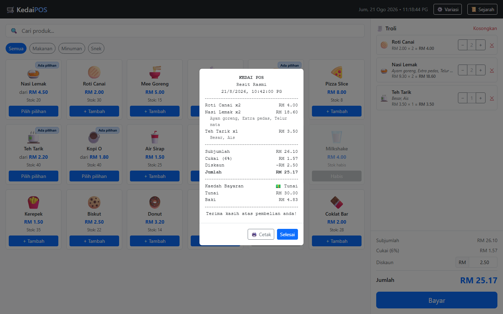

Resit mengandungi:

- Nama kedai, tarikh dan masa transaksi
- Senarai item beserta kuantiti dan variasi yang dipilih
- Subjumlah, cukai, diskaun dan jumlah akhir
- **Kaedah Bayaran** — Tunai, Kad atau QR Code
- Amaun tunai diterima dan baki (bayaran tunai sahaja)

Bagi bayaran **Kad** dan **QR Code**, baris *Tunai* dan *Baki* digantikan dengan satu
baris **Dibayar** sahaja:

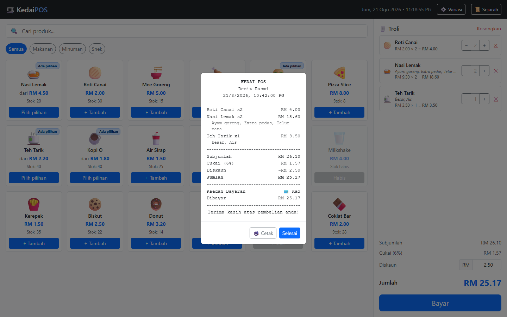

**Pilihan pada resit:**

- **🖨️ Cetak** — buka dialog cetakan pelayar untuk mencetak resit
- **Selesai** — tutup resit dan kembali ke skrin utama

Selepas bayaran disahkan, sistem akan:

1. Mengosongkan troli secara automatik
2. Menetapkan semula medan diskaun kepada `0`
3. Menolak stok setiap produk yang dijual
4. Menyimpan rekod ke dalam sejarah transaksi berserta kaedah bayarannya

---

## Langkah 17 — Semak Sejarah Transaksi

Tekan butang **📜 Sejarah** pada bar atas untuk melihat rekod jualan yang lepas.

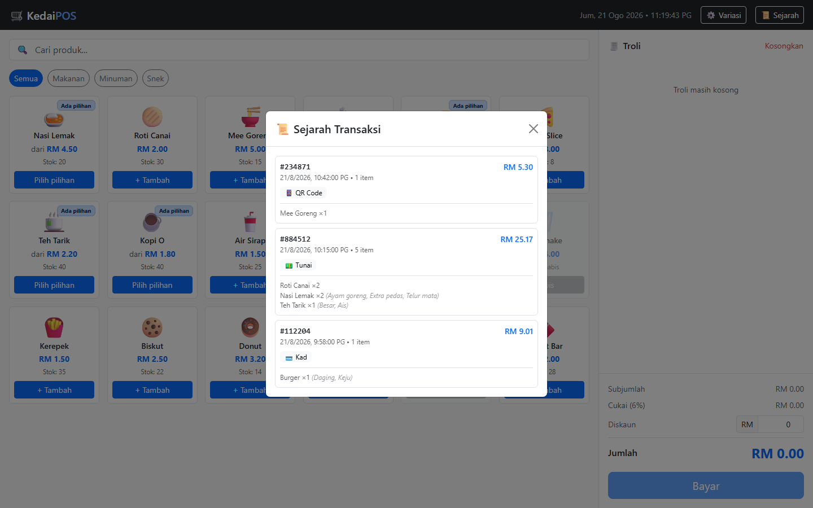

Setiap rekod memaparkan nombor rujukan transaksi, jumlah bayaran, tarikh dan masa,
bilangan item, **lencana kaedah bayaran**, serta senarai ringkas item berserta variasinya.

Lencana kaedah memudahkan penyesuaian wang tunai pada hujung hari — kira hanya rekod
berlencana **💵 Tunai**, manakala **💳 Kad** dan **📱 QR Code** disemak melalui penyata bank.

---

## Petua Pantas

| Situasi | Tindakan |
|---|---|
| Pelanggan tukar fikiran pasal satu item | Tekan **✕** pada baris item tersebut |
| Pelanggan batalkan keseluruhan pesanan | Tekan **Kosongkan** di atas panel troli |
| Nak tambah item sama dengan variasi berbeza | Tekan kad produk semula dan pilih variasi baharu |
| Nak cari produk dengan pantas | Taip dalam medan carian, jangan skrol |
| Tersalah masuk amaun tunai | Padam dan taip semula — baki dikira semula automatik |
| Nak isi amaun tunai dengan pantas | Tekan salah satu butang wang pantas di bawah medan tunai |
| Pelanggan tukar daripada tunai kepada kad | Tekan butang **💳 Kad** — medan tunai hilang serta-merta |
| Terminal kad gagal, pelanggan bayar tunai | Tekan semula butang **💵 Tunai** dan masukkan wang diterima |
| Nak batalkan sebelum sahkan bayaran | Tekan **Batal** pada tetingkap pembayaran |

---

## Masalah Lazim

**Butang Bayar tidak boleh ditekan**
Troli masih kosong. Tambah sekurang-kurangnya satu item terlebih dahulu.

**Butang Tambah dalam tetingkap variasi tidak berfungsi**
Ada kumpulan wajib (bertanda `*`) yang belum dipilih. Semak kumpulan seperti
**Lauk** atau **Saiz** dan pastikan satu pilihan telah dibuat.

**Produk kelihatan kelabu dan tidak boleh ditekan**
Stok produk tersebut telah habis. Kad akan memaparkan label **Habis**.

**Sistem tidak benarkan sahkan bayaran**
Kaedah **Tunai** dipilih tetapi wang yang dimasukkan kurang daripada jumlah perlu
dibayar. Semak semula amaun tunai, atau tukar kepada kaedah **Kad** / **QR Code**
yang tidak memerlukan medan tunai.

**Medan Wang Diterima hilang dari skrin**
Kaedah **Kad** atau **QR Code** sedang dipilih. Tekan butang **💵 Tunai** untuk
memaparkannya semula.

**Tersalah pilih kaedah bayaran selepas resit dicetak**
Rekod yang telah disahkan tidak boleh disunting. Catat pembetulan secara manual dan
laporkan kepada penyelia.

**Sejarah transaksi kosong selepas kosongkan data pelayar**
Sejarah disimpan dalam storan setempat pelayar. Membersihkan data pelayar akan
memadamkan rekod tersebut.

---

*Dokumen ini dijana secara automatik menggunakan pelayar tanpa kepala (headless Chrome).
Semua gambar skrin diambil daripada sistem yang sedang berjalan.*
