# Panduan Pengguna — Modul Variasi KedaiPOS

**Cara memilih variasi produk semasa jualan dan cara mengurus senarai variasi itu sendiri**

Versi 1.0 · Kemas kini 17 Ogos 2026

---

## Kandungan

**Bahagian A — Menjual produk yang ada variasi**

1. [Pengenalan](#1-pengenalan)
2. [Mengenali Antara Muka](#2-mengenali-antara-muka)
3. [Langkah 1 — Kenal pasti produk yang ada variasi](#langkah-1--kenal-pasti-produk-yang-ada-variasi)
4. [Langkah 2 — Buka tetingkap pilihan](#langkah-2--buka-tetingkap-pilihan)
5. [Langkah 3 — Pilih pilihan wajib](#langkah-3--pilih-pilihan-wajib)
6. [Langkah 4 — Tambah pilihan tambahan](#langkah-4--tambah-pilihan-tambahan)
7. [Langkah 5 — Tetapkan kuantiti](#langkah-5--tetapkan-kuantiti)
8. [Langkah 6 — Tambah ke troli](#langkah-6--tambah-ke-troli)
9. [Langkah 7 — Kombinasi berbeza menjadi baris berasingan](#langkah-7--kombinasi-berbeza-menjadi-baris-berasingan)
10. [Langkah 8 — Kombinasi sama bergabung menjadi satu baris](#langkah-8--kombinasi-sama-bergabung-menjadi-satu-baris)
11. [Langkah 9 — Semak variasi pada resit](#langkah-9--semak-variasi-pada-resit)
12. [Langkah 10 — Semak variasi dalam sejarah transaksi](#langkah-10--semak-variasi-dalam-sejarah-transaksi)

**Bahagian B — Mengurus variasi produk**

13. [Langkah 11 — Buka panel Urus Variasi Produk](#langkah-11--buka-panel-urus-variasi-produk)
14. [Langkah 12 — Pilih produk yang hendak diberi variasi](#langkah-12--pilih-produk-yang-hendak-diberi-variasi)
15. [Langkah 13 — Tambah kumpulan variasi](#langkah-13--tambah-kumpulan-variasi)
16. [Langkah 14 — Isi nama pilihan dan harga tambahan](#langkah-14--isi-nama-pilihan-dan-harga-tambahan)
17. [Langkah 15 — Tambah kumpulan jenis "Pilih berbilang"](#langkah-15--tambah-kumpulan-jenis-pilih-berbilang)
18. [Langkah 16 — Simpan perubahan](#langkah-16--simpan-perubahan)
19. [Langkah 17 — Uji variasi baharu di skrin jualan](#langkah-17--uji-variasi-baharu-di-skrin-jualan)
20. [Langkah 18 — Buang pilihan atau kumpulan](#langkah-18--buang-pilihan-atau-kumpulan)
21. [Langkah 19 — Reset semua variasi ke asal](#langkah-19--reset-semua-variasi-ke-asal)
22. [Petua Pantas](#petua-pantas)
23. [Masalah Lazim](#masalah-lazim)

---

## 1. Pengenalan

KedaiPOS ialah sistem jualan (Point of Sale) untuk kedai makan. **Modul variasi** ialah
bahagian yang membenarkan satu produk dijual dalam beberapa bentuk berbeza — contohnya
Nasi Lemak dengan lauk ayam goreng, atau Teh Tarik saiz besar dengan ais.

Setiap pilihan boleh menambah atau mengurangkan harga. Sistem mengira harga akhir secara
automatik, mencatat pilihan itu pada baris troli, dan mencetaknya pada resit supaya dapur
tahu apa yang perlu disediakan.

Panduan ini dibahagikan kepada dua bahagian:

- **Bahagian A** untuk juruwang — cara memilih variasi semasa membuat jualan.
- **Bahagian B** untuk penyelia atau pemilik kedai — cara menambah, mengubah dan membuang
  variasi melalui panel **⚙️ Variasi**.

**Keperluan:**

- Pelayar web moden (Chrome, Edge, atau Firefox)
- Alamat sistem: `http://localhost/claude-learn1/`
- Tiada log masuk diperlukan — panel **⚙️ Variasi** terbuka kepada sesiapa yang menggunakan
  komputer itu

---

## 2. Mengenali Antara Muka

Skrin utama terbahagi kepada tiga bahagian yang berkaitan dengan modul variasi:

| Bahagian | Lokasi | Fungsi |
|---|---|---|
| **Bar atas** | Paling atas | Mengandungi butang **⚙️ Variasi** (urus variasi) dan **📜 Sejarah** |
| **Panel produk** | Kiri dan tengah | Memaparkan kad produk; produk bervariasi ditanda lencana **Ada pilihan** |
| **Panel troli** | Kanan | Memaparkan setiap baris jualan berserta pilihan variasi yang dipilih |

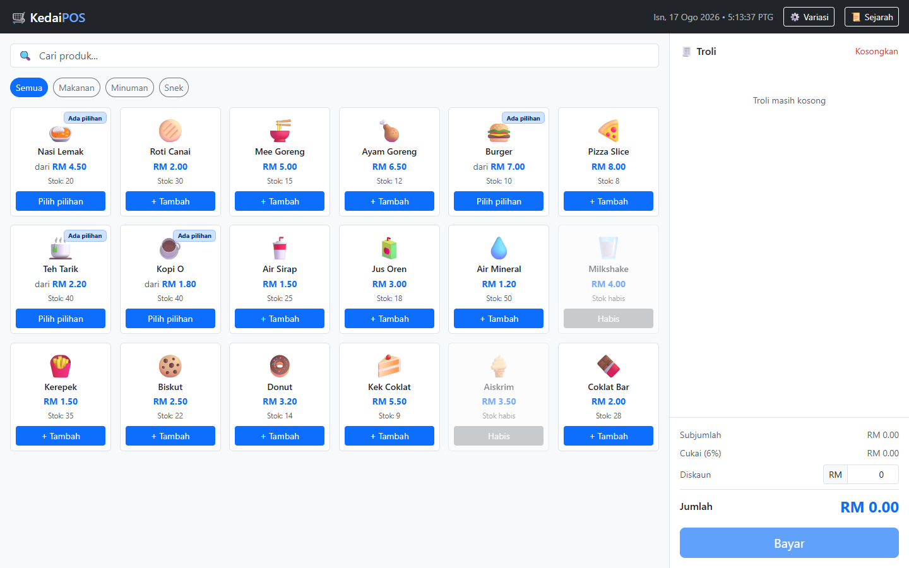

Maklumat penting pada skrin ini:

- Lencana **Ada pilihan** bermaksud produk itu mempunyai variasi.
- Harga produk bervariasi ditulis **dari RM 4.50** — "dari" bermaksud itu harga terendah,
  sebelum sebarang pilihan berbayar ditambah.
- Butang pada kad bertukar daripada **+ Tambah** kepada **Pilih pilihan** bagi produk
  bervariasi.
- Nombor **Stok** dikongsi oleh semua variasi produk yang sama. Nasi Lemak berlauk ayam dan
  berlauk rendang mengambil stok daripada kolam yang sama.

---

## Langkah 1 — Kenal pasti produk yang ada variasi

Sebelum menekan apa-apa, lihat kad produk. Produk biasa terus masuk ke troli apabila
ditekan. Produk bervariasi pula membuka tetingkap pilihan terlebih dahulu.

Contoh: kad **Nasi Lemak** memaparkan lencana **Ada pilihan**, harga **dari RM 4.50**, dan
butang **Pilih pilihan**.

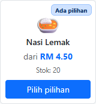

Pada data asal sistem, empat produk mempunyai variasi:

| Produk | Harga asas | Kumpulan variasi |
|---|---|---|
| 🍛 Nasi Lemak | RM 4.50 | Lauk, Kepedasan, Tambahan |
| 🍔 Burger | RM 7.00 | Jenis Patty, Tambahan |
| 🍵 Teh Tarik | RM 2.20 | Saiz, Suhu, Tambahan |
| ☕ Kopi O | RM 1.80 | Saiz, Paras Gula |

> **Nota:** Produk yang kehabisan stok memaparkan butang **Habis** dan tidak boleh ditekan,
> walaupun ia mempunyai variasi.

---

## Langkah 2 — Buka tetingkap pilihan

Tekan kad produk. Tetingkap pilihan akan terbuka dengan nama produk, harga asas, dan baki
stok pada bahagian atas.

Contoh: menekan **Nasi Lemak** membuka tetingkap bertajuk *Nasi Lemak*, dengan subtajuk
*Harga asas RM 4.50 • Stok 20*, dan tiga kumpulan pilihan — **Lauk**, **Kepedasan**, dan
**Tambahan**.

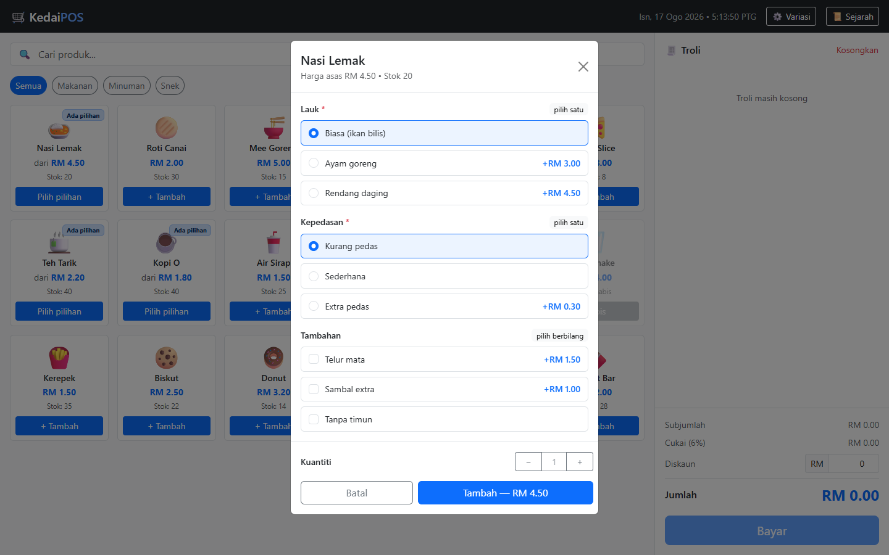

Setiap kumpulan mempunyai dua penanda yang perlu difahami:

| Penanda | Maksud |
|---|---|
| Bintang merah `*` selepas nama kumpulan | Kumpulan itu **wajib** — mesti ada sekurang-kurangnya satu pilihan |
| Lencana **pilih satu** | Hanya satu pilihan boleh dipilih (bulatan) |
| Lencana **pilih berbilang** | Boleh pilih seberapa banyak pilihan (kotak semak) |
| **+RM 3.00** di sebelah kanan pilihan | Harga tambahan bagi pilihan itu |
| **−RM 0.20** di sebelah kanan pilihan | Potongan harga bagi pilihan itu |

> **Nota:** Bagi kumpulan wajib jenis **pilih satu**, sistem terus memilih pilihan pertama
> untuk anda. Anda hanya perlu menukarnya jika pelanggan mahu yang lain.

---

## Langkah 3 — Pilih pilihan wajib

Tekan pilihan yang dikehendaki pelanggan bagi setiap kumpulan bertanda `*`. Harga pada
butang biru di bawah akan berubah serta-merta.

Contoh: pilih **Ayam goreng** (+RM 3.00) dalam kumpulan **Lauk** dan **Extra pedas**
(+RM 0.30) dalam kumpulan **Kepedasan**. Butang bertukar menjadi **Tambah — RM 7.80**,
iaitu RM 4.50 + RM 3.00 + RM 0.30.

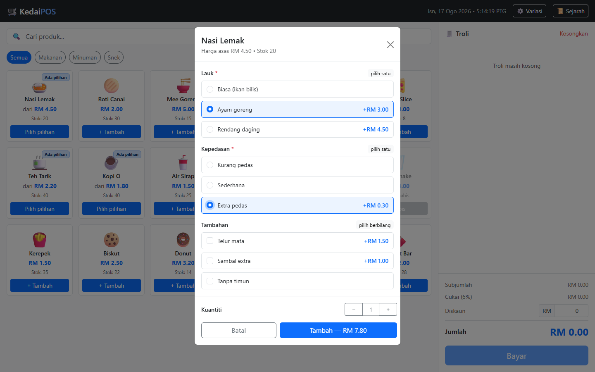

> **Petua:** Sahkan harga pada butang **Tambah** bersama pelanggan sebelum meneruskan. Itu
> harga sebenar bagi satu unit dengan pilihan semasa.

---

## Langkah 4 — Tambah pilihan tambahan

Kumpulan jenis **pilih berbilang** membenarkan lebih daripada satu pilihan pada masa yang
sama. Tekan setiap kotak semak yang dikehendaki; tekan sekali lagi untuk membatalkannya.

Contoh: dalam kumpulan **Tambahan**, tandakan **Telur mata** (+RM 1.50) dan **Sambal extra**
(+RM 1.00). Butang kini memaparkan **Tambah — RM 10.30**.

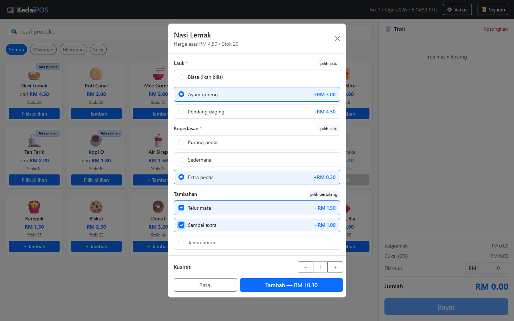

> **Nota:** Kumpulan **Tambahan** tidak bertanda `*`, jadi ia boleh dibiarkan kosong. Pilihan
> seperti **Tanpa timun** berharga RM 0.00 — ia hanya arahan kepada dapur, bukan caj.

---

## Langkah 5 — Tetapkan kuantiti

Guna butang **−** dan **+** di bahagian bawah tetingkap untuk menetapkan bilangan unit
dengan kombinasi pilihan yang sama.

Contoh: tekan **+** sekali sehingga kuantiti menjadi **2**. Butang bertukar menjadi
**Tambah — RM 20.60**, iaitu RM 10.30 × 2.

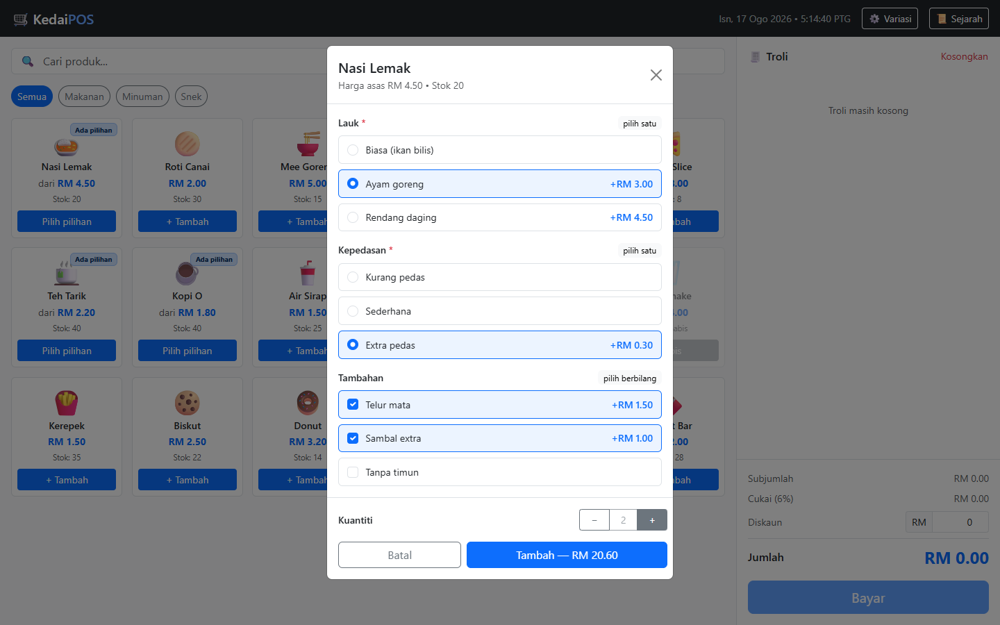

> **Nota:** Kuantiti tidak boleh kurang daripada 1. Untuk membatalkan sepenuhnya, tekan
> **Batal**.

---

## Langkah 6 — Tambah ke troli

Tekan butang **Tambah — RM 20.60**. Tetingkap akan tertutup dan barisan baharu muncul dalam
troli.

Baris troli memaparkan tiga maklumat: nama produk, senarai pilihan dalam tulisan condong,
dan pengiraan `harga seunit × kuantiti`.

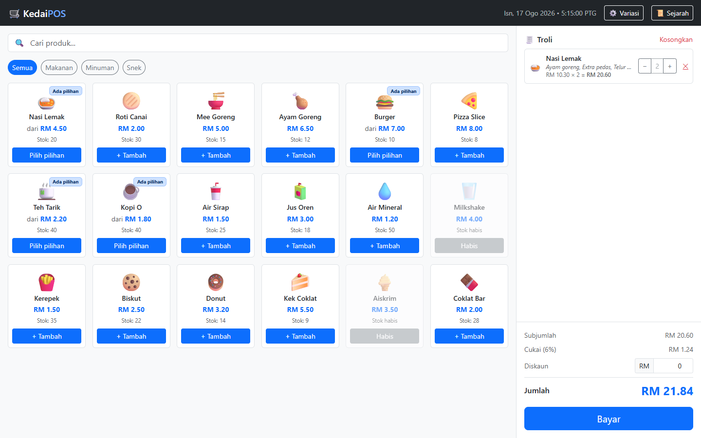

> **Nota:** Jika senarai pilihan terlalu panjang, ia dipendekkan dengan tanda `…` dalam
> troli. Senarai penuh tetap dicetak pada resit.

---

## Langkah 7 — Kombinasi berbeza menjadi baris berasingan

Setiap kombinasi pilihan yang berlainan menjadi baris troli tersendiri, walaupun produknya
sama. Ini membolehkan harga dan arahan dapur kekal betul bagi setiap pesanan.

Contoh: tambah **Nasi Lemak** sekali lagi, kali ini dengan **Rendang daging** (+RM 4.50) dan
**Sederhana**. Troli kini mempunyai dua baris Nasi Lemak — satu RM 10.30 seunit, satu lagi
RM 9.00 seunit.

> **Petua:** Guna butang **−** dan **+** pada baris troli untuk melaraskan kuantiti tanpa
> membuka semula tetingkap pilihan. Butang **✕** membuang baris itu sahaja.

---

## Langkah 8 — Kombinasi sama bergabung menjadi satu baris

Jika anda menambah produk dengan kombinasi pilihan yang **sama persis**, sistem tidak
membuat baris baharu. Ia hanya menambah kuantiti pada baris sedia ada.

Contoh: tambah semula Nasi Lemak dengan **Ayam goreng, Extra pedas, Telur mata, Sambal
extra**. Baris pertama bertukar daripada kuantiti 2 kepada **3**, dan jumlahnya menjadi
RM 30.90.

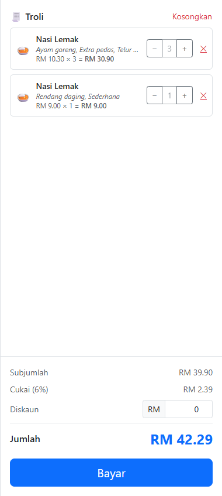

> **Nota:** Susunan pilihan tidak penting. **Telur mata + Sambal extra** dikira sama dengan
> **Sambal extra + Telur mata**.

---

## Langkah 9 — Semak variasi pada resit

Selesaikan jualan seperti biasa: tekan **Bayar**, masukkan wang yang diterima, kemudian
tekan **Sahkan Bayaran**. Resit akan terbuka.

Pada resit, pilihan variasi dicetak dalam baris kecil di bawah nama produk. Bahagian dapur
dan pelanggan boleh mengesahkan pesanan daripada baris ini.

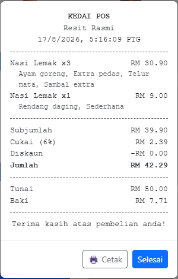

Contoh di atas: `Nasi Lemak x3` dengan *Ayam goreng, Extra pedas, Telur mata, Sambal extra*
berjumlah RM 30.90, dan `Nasi Lemak x1` dengan *Rendang daging, Sederhana* berjumlah
RM 9.00. Cukai 6% dikira ke atas subjumlah selepas variasi.

> **Amaran:** Transaksi yang telah disahkan tidak boleh dibatalkan. Semak pilihan variasi
> pada troli sebelum menekan **Sahkan Bayaran**.

---

## Langkah 10 — Semak variasi dalam sejarah transaksi

Tekan **📜 Sejarah** pada bar atas untuk melihat transaksi lepas. Setiap rekod menyenaraikan
item berserta pilihan variasi dalam kurungan.

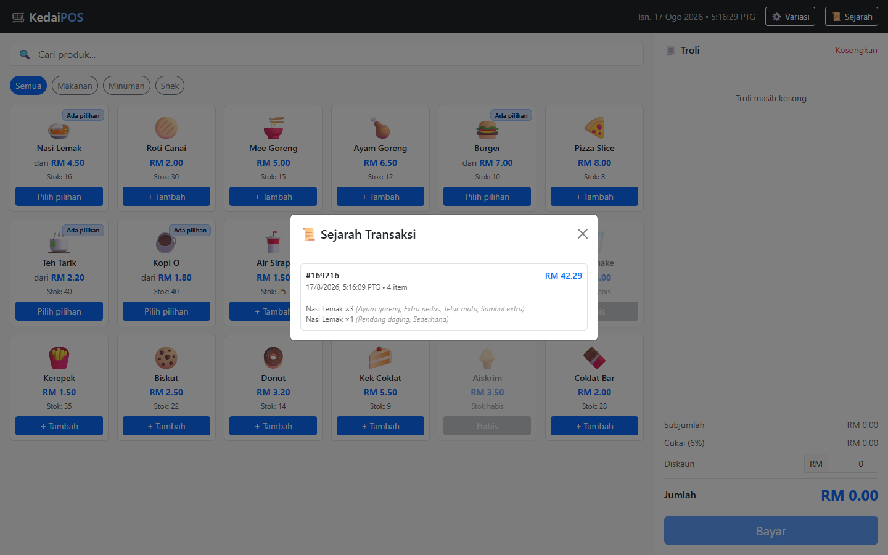

> **Nota:** Sejarah menyimpan 50 transaksi terkini dalam pelayar komputer itu sahaja. Ia
> tidak dikongsi antara komputer.

---

## Langkah 11 — Buka panel Urus Variasi Produk

Tekan butang **⚙️ Variasi** pada bar atas. Tetingkap **⚙️ Urus Variasi Produk** akan terbuka.

Tetingkap ini terbahagi kepada dua lajur:

| Lajur | Kandungan |
|---|---|
| **Kiri** | Senarai semua produk, dengan kiraan **N kumpulan** atau label **tiada variasi** |
| **Kanan** | Editor bagi produk yang sedang dipilih — nama produk, harga asas, dan semua kumpulan variasinya |

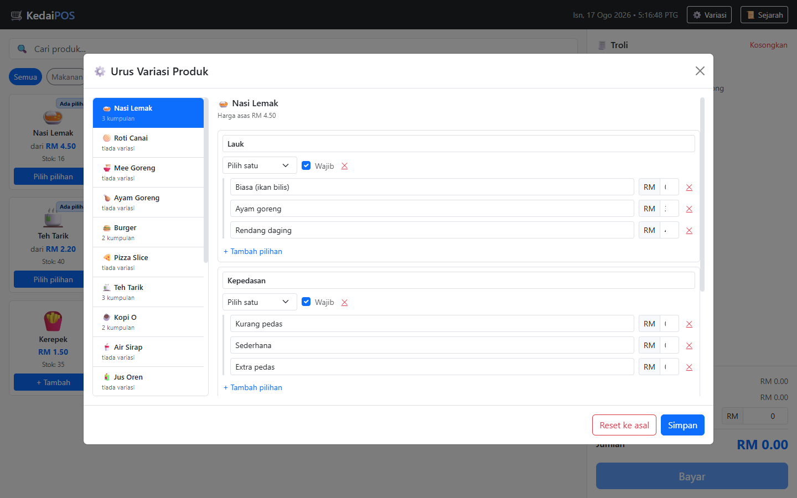

> **Nota:** Perubahan yang anda buat di sini **belum** disimpan sehingga butang **Simpan**
> ditekan. Menutup tetingkap dengan **✕** membatalkan semua perubahan.

---

## Langkah 12 — Pilih produk yang hendak diberi variasi

Tekan nama produk pada lajur kiri. Editor di sebelah kanan akan bertukar kepada produk itu.

Contoh: tekan **🫓 Roti Canai**. Kerana produk ini belum mempunyai variasi, editor
memaparkan mesej *Tiada variasi. Produk ini terus masuk troli bila ditekan.*

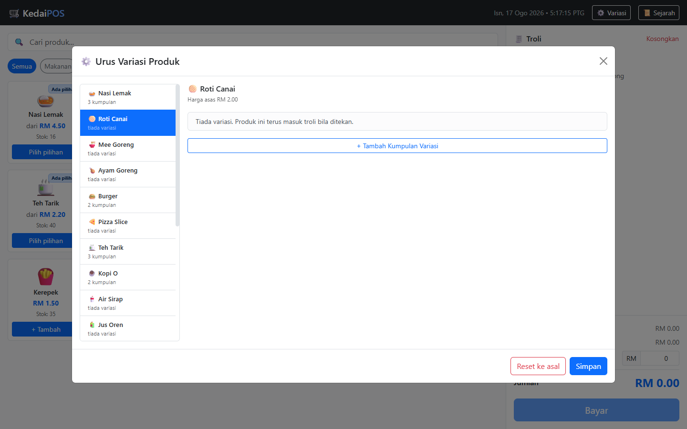

---

## Langkah 13 — Tambah kumpulan variasi

Tekan butang **+ Tambah Kumpulan Variasi** di bahagian bawah editor. Satu kumpulan baharu
akan muncul dengan nilai lalai: nama *Kumpulan baharu*, jenis **Pilih satu**, kotak
**Wajib** bertanda, dan satu pilihan bernama *Pilihan 1* berharga RM 0.

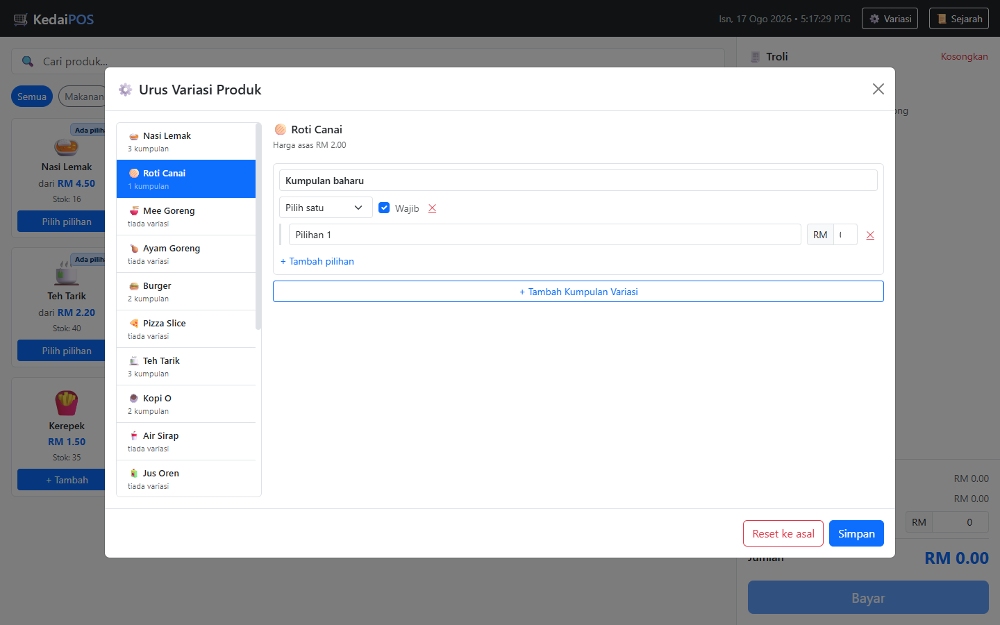

Tetapkan tiga perkara pada baris atas kumpulan:

| Medan | Fungsi |
|---|---|
| **Nama kumpulan** | Tajuk yang dilihat juruwang, contohnya `Jenis Roti` atau `Saiz` |
| Senarai **Pilih satu / Pilih berbilang** | Menentukan sama ada pilihan dipaparkan sebagai bulatan atau kotak semak |
| Kotak **Wajib** | Jika bertanda, juruwang mesti memilih sekurang-kurangnya satu pilihan |

Contoh: tukar nama kumpulan kepada **Jenis Roti**, kekalkan **Pilih satu**, dan kekalkan
kotak **Wajib** bertanda.

---

## Langkah 14 — Isi nama pilihan dan harga tambahan

Setiap pilihan mempunyai dua medan: nama pilihan di kiri, dan harga tambahan dalam kotak
**RM** di kanan. Tekan **+ Tambah pilihan** untuk menambah baris pilihan baharu.

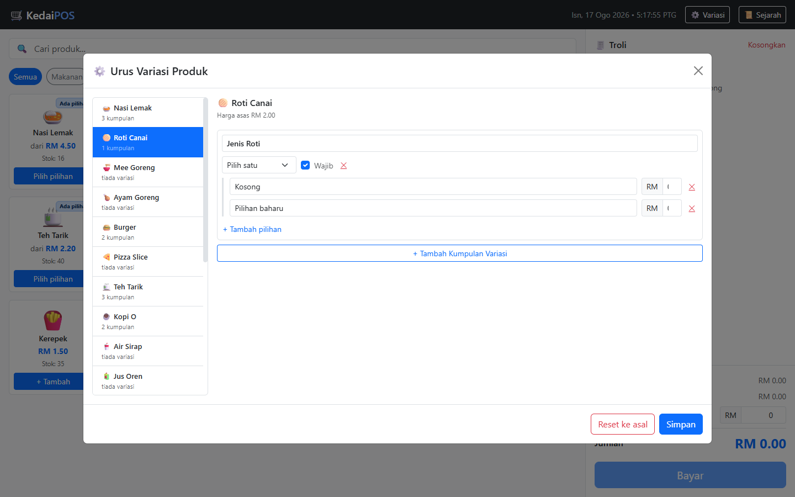

Contoh: bina kumpulan **Jenis Roti** dengan tiga pilihan.

| Nama pilihan | Harga tambahan |
|---|---|
| Kosong | 0 |
| Telur | 1.50 |
| Bawang | 1.00 |

> **Petua:** Isikan harga tambahan sahaja, bukan harga penuh. Sistem menambahnya kepada
> harga asas produk. Untuk potongan harga, masukkan nilai negatif seperti `-0.20`.

---

## Langkah 15 — Tambah kumpulan jenis "Pilih berbilang"

Ulang **+ Tambah Kumpulan Variasi** untuk kumpulan kedua, kemudian tukar senarai jenis
kepada **Pilih berbilang**. Juruwang kemudiannya boleh memilih lebih daripada satu pilihan
dalam kumpulan itu.

Contoh: bina kumpulan **Kuah** dengan jenis **Pilih berbilang** dan kotak **Wajib**
bertanda, mengandungi **Kuah dhal** (0), **Kuah kari ayam** (0.50) dan **Sambal** (0.50).

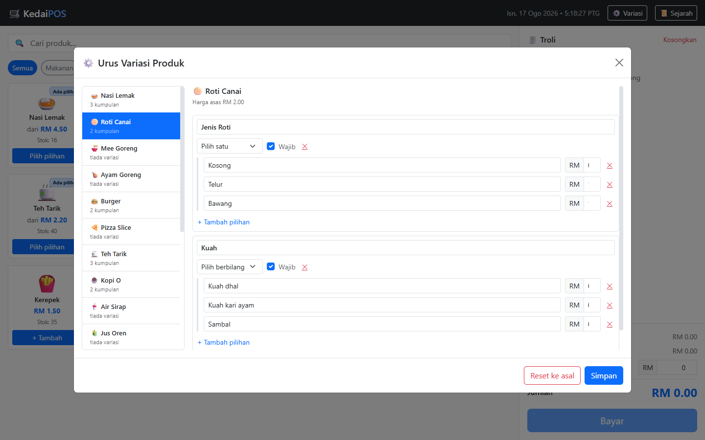

> **Nota:** Kumpulan **Pilih berbilang** yang ditandakan **Wajib** memaksa juruwang memilih
> sekurang-kurangnya satu pilihan. Kesannya dilihat pada [Langkah 17](#langkah-17--uji-variasi-baharu-di-skrin-jualan).

---

## Langkah 16 — Simpan perubahan

Tekan butang **Simpan**. Sistem menyemak semua produk terlebih dahulu, dan menolak simpanan
jika ada medan yang tidak lengkap.

Contoh ralat: jika nama kumpulan dibiarkan kosong, mesej *Kumpulan variasi dalam "Roti
Canai" tiada nama* muncul di bahagian bawah skrin dan tetingkap kekal terbuka.

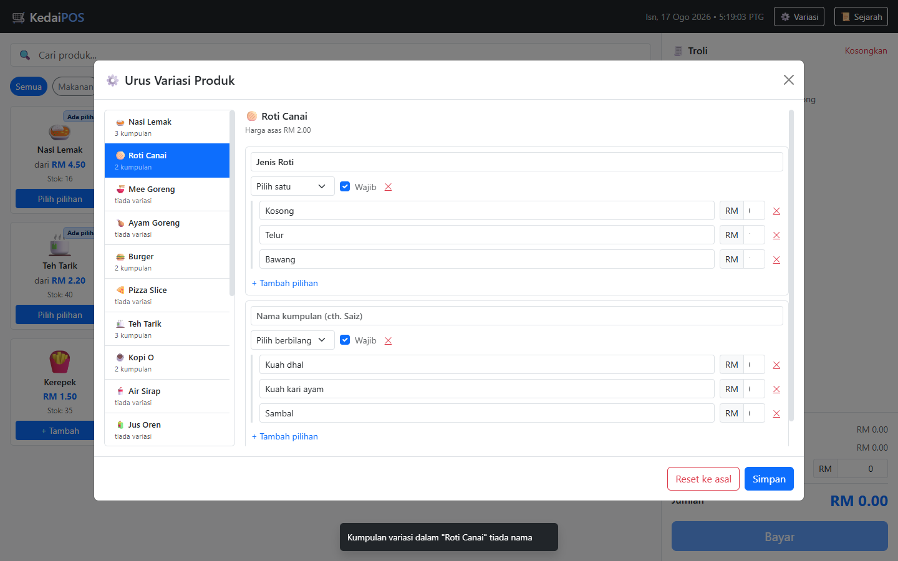

Tiga pemeriksaan yang dilakukan sebelum simpanan diterima:

| Pemeriksaan | Mesej yang dipaparkan |
|---|---|
| Nama kumpulan kosong | Kumpulan variasi dalam "*produk*" tiada nama |
| Kumpulan tanpa sebarang pilihan | Kumpulan "*nama*" dalam "*produk*" tiada pilihan |
| Nama pilihan kosong | Ada pilihan tanpa nama dalam kumpulan "*nama*" |

Betulkan medan yang disebut, kemudian tekan **Simpan** semula. Mesej **Variasi disimpan**
akan muncul, tetingkap tertutup, dan kad produk dikemas kini serta-merta.

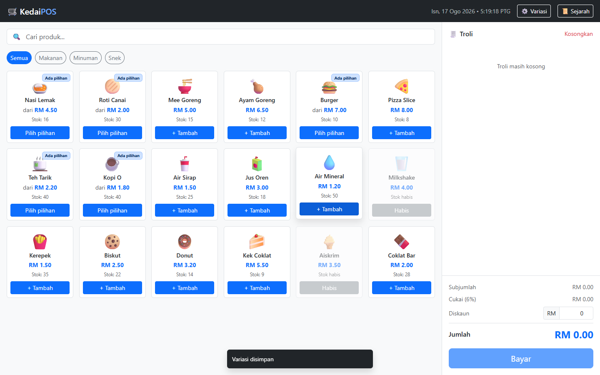

> **Nota:** Variasi disimpan dalam storan pelayar komputer itu sahaja. Komputer lain di
> kedai yang sama tidak menerima perubahan ini secara automatik.

---

## Langkah 17 — Uji variasi baharu di skrin jualan

Tekan kad produk yang baru diubah untuk mengesahkan variasinya betul.

Contoh: menekan **Roti Canai** kini membuka tetingkap dengan dua kumpulan. Kumpulan **Jenis
Roti** sudah terpilih **Kosong** secara automatik, tetapi kumpulan **Kuah** masih kosong —
jadi butang bawah dilumpuhkan dan bertukar menjadi **Sila pilih pilihan wajib**.

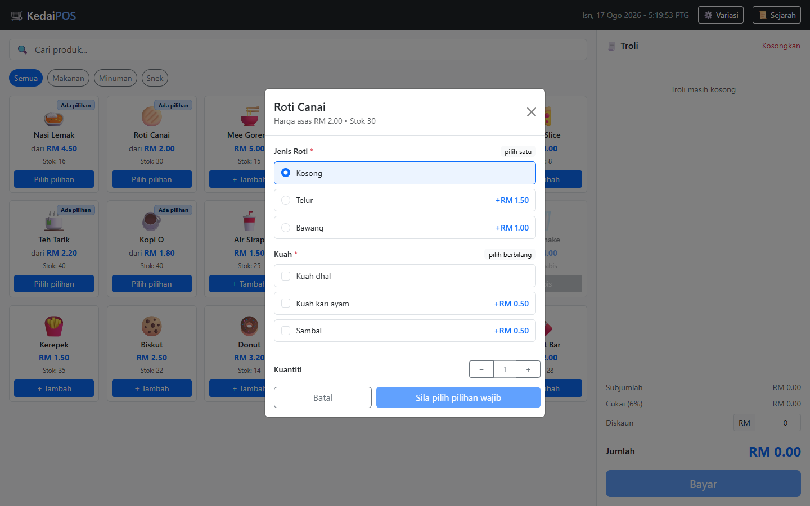

Selepas **Kuah dhal** dan **Sambal** ditandakan, butang menjadi aktif dan memaparkan
**Tambah — RM 2.50**, iaitu RM 2.00 + RM 0.00 + RM 0.50.

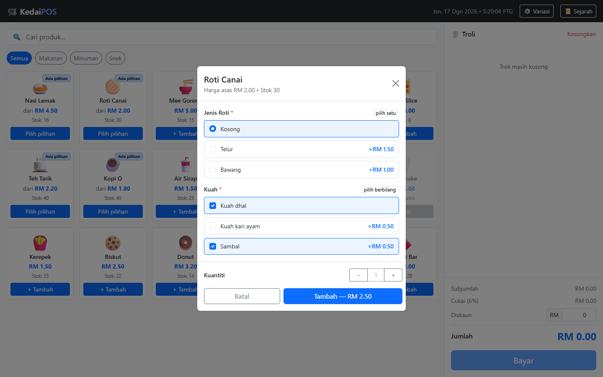

> **Petua:** Jika butang kekal dilumpuhkan, cari kumpulan bertanda `*` yang belum mempunyai
> sebarang pilihan bertanda.

---

## Langkah 18 — Buang pilihan atau kumpulan

Dalam panel **⚙️ Variasi**, setiap baris pilihan dan setiap kepala kumpulan mempunyai butang
**✕** merah.

- **✕** pada baris pilihan membuang pilihan itu sahaja.
- **✕** pada baris nama kumpulan membuang seluruh kumpulan berserta semua pilihannya.

Contoh: membuang pilihan **Bawang** meninggalkan **Kosong** dan **Telur** dalam kumpulan
**Jenis Roti**.

> **Amaran:** Pembuangan berlaku serta-merta tanpa soalan pengesahan. Jika tersilap buang,
> tutup tetingkap dengan **✕** tanpa menekan **Simpan** — semua perubahan yang belum
> disimpan akan dibatalkan.

---

## Langkah 19 — Reset semua variasi ke asal

Butang **Reset ke asal** memulihkan senarai variasi kepada tetapan asal sistem bagi
**semua** produk sekali gus.

Tekan **Reset ke asal**, kemudian tekan **OK** pada soalan pengesahan *Reset semua variasi
kepada tetapan asal? Perubahan tersimpan akan hilang.*

Mesej **Variasi direset kepada asal** akan muncul. Dalam contoh ini, **Roti Canai** kembali
berlabel *tiada variasi* dan variasi asal Nasi Lemak dipaparkan semula.

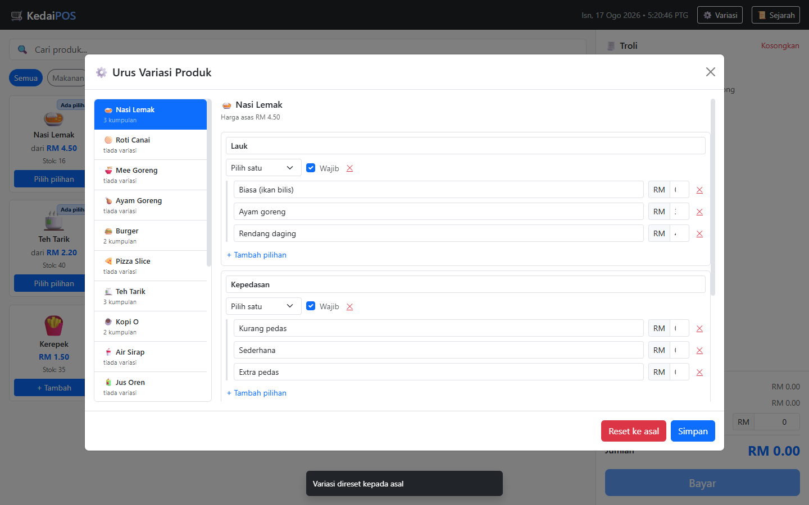

> **Amaran:** Reset membuang semua variasi yang pernah anda simpan, bukan hanya perubahan
> terakhir. Ia tidak boleh diundur.

---

## Petua Pantas

- Tekan kad produk bervariasi berulang kali dengan pilihan yang sama untuk menambah
  kuantiti — baris troli akan bergabung secara automatik.
- Untuk pesanan berlainan bagi produk yang sama, buka tetingkap pilihan sekali bagi setiap
  kombinasi. Jangan laraskan kuantiti pada baris sedia ada.
- Namakan pilihan mengikut cara pelanggan bercakap (`Extra pedas`, `Tanpa ais`) supaya
  juruwang tidak perlu menterjemah pesanan.
- Guna pilihan berharga RM 0 untuk arahan dapur seperti **Tanpa timun** atau **Kurang
  manis**.
- Gunakan nilai negatif seperti `-0.20` untuk pilihan yang memberi potongan, contohnya
  **Tanpa ais** pada Teh Tarik.
- Sebelum mengubah variasi pada waktu sibuk, ingat bahawa perubahan hanya berkuat kuasa
  pada komputer yang anda gunakan.

---

## Masalah Lazim

| Masalah | Sebab | Penyelesaian |
|---|---|---|
| Butang bawah tertulis **Sila pilih pilihan wajib** dan tidak boleh ditekan | Ada kumpulan bertanda `*` yang belum dipilih | Tandakan sekurang-kurangnya satu pilihan dalam setiap kumpulan bertanda `*` |
| Menekan kad produk terus masuk troli tanpa tetingkap pilihan | Produk itu tiada variasi | Tambah kumpulan variasi melalui **⚙️ Variasi** ([Langkah 13](#langkah-13--tambah-kumpulan-variasi)) |
| Mesej **Stok "Nasi Lemak" tidak mencukupi** | Semua variasi produk berkongsi kolam stok yang sama | Kurangkan kuantiti, atau kemas kini stok produk |
| Troli menunjukkan dua baris untuk produk yang nampak sama | Kombinasi pilihannya berbeza | Bandingkan baris kecil condong di bawah nama produk |
| Senarai pilihan dalam troli terpotong dengan `…` | Ruang panel troli terhad | Rujuk resit atau **📜 Sejarah** untuk senarai penuh |
| Perubahan variasi hilang selepas tetingkap ditutup | Butang **Simpan** tidak ditekan | Tekan **Simpan** sebelum menutup tetingkap |
| Mesej *Kumpulan "..." tiada pilihan* semasa menyimpan | Kumpulan itu tiada baris pilihan | Tekan **+ Tambah pilihan**, atau buang kumpulan itu dengan **✕** |
| Variasi baharu tidak kelihatan pada komputer lain | Variasi disimpan dalam storan pelayar setempat | Ulang tetapan pada komputer berkenaan |
| Semua variasi tersuai hilang | Butang **Reset ke asal** telah ditekan | Bina semula variasi — reset tidak boleh diundur |
